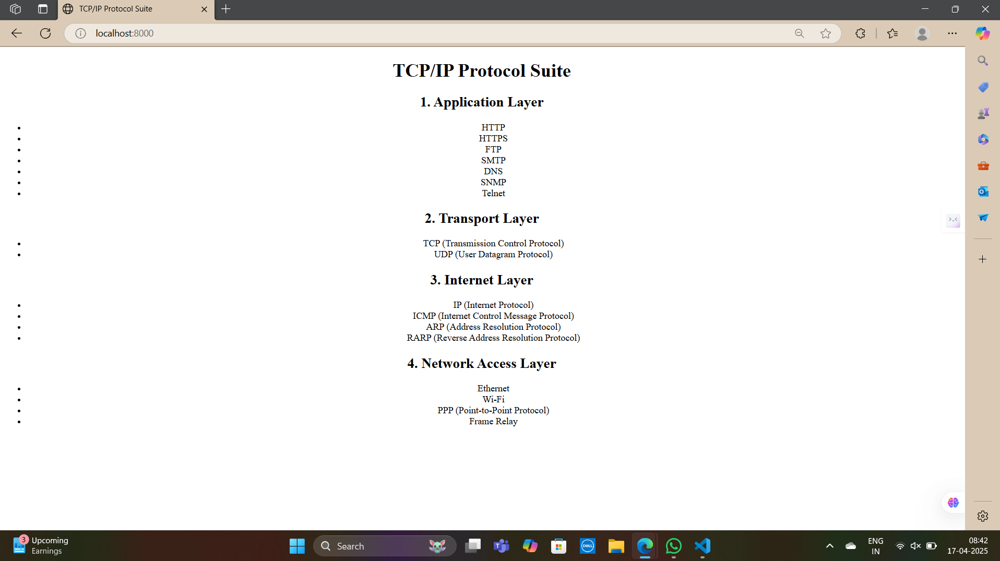
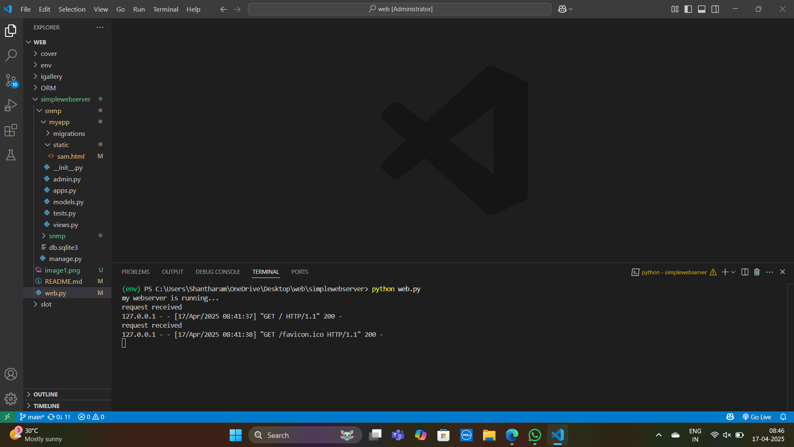

# EX01 Developing a Simple Webserver
## Date: 01-03-2025

## AIM:
To develop a simple webserver to serve html pages and display the list of protocols in TCP/IP Protocol Suite.

## DESIGN STEPS:
### Step 1: 
HTML content creation.

### Step 2:
Design of webserver workflow.

### Step 3:
Implementation using Python code.

### Step 4:
Import the necessary modules.

### Step 5:
Define a custom request handler.

### Step 6:
Start an HTTP server on a specific port.

### Step 7:
Run the Python script to serve web pages.

### Step 8:
Serve the HTML pages.

### Step 9:
Start the server script and check for errors.

### Step 10:
Open a browser and navigate to http://127.0.0.1:8000 (or the assigned port).

## PROGRAM:
```
from http.server import HTTPServer, BaseHTTPRequestHandler
content = """
<!DOCTYPE html>
<html lang="en">
<head>
    <meta charset="UTF-8">
    <title>TCP/IP Protocol Suite</title>
</head>
<body>

    <center>
        <h1>TCP/IP Protocol Suite</h1>

        <h2>1. Application Layer</h2>
        <ul>
            <li>HTTP</li>
            <li>HTTPS</li>
            <li>FTP</li>
            <li>SMTP</li>
            <li>DNS</li>
            <li>SNMP</li>
            <li>Telnet</li>
        </ul>

        <h2>2. Transport Layer</h2>
        <ul>
            <li>TCP (Transmission Control Protocol)</li>
            <li>UDP (User Datagram Protocol)</li>
        </ul>

        <h2>3. Internet Layer</h2>
        <ul>
            <li>IP (Internet Protocol)</li>
            <li>ICMP (Internet Control Message Protocol)</li>
            <li>ARP (Address Resolution Protocol)</li>
            <li>RARP (Reverse Address Resolution Protocol)</li>
        </ul>

        <h2>4. Network Access Layer</h2>
        <ul>
            <li>Ethernet</li>
            <li>Wi-Fi</li>
            <li>PPP (Point-to-Point Protocol)</li>
            <li>Frame Relay</li>
        </ul>
    </center>

</body>
</html>

"""
class myhandler(BaseHTTPRequestHandler):
    def do_GET(self):
        print("request received")
        self.send_response(200)
        self.send_header('content-type', 'text/html; charset=utf-8')
        self.end_headers()
        self.wfile.write(content.encode())
server_address = ('',8000)
httpd = HTTPServer(server_address,myhandler)
print("my webserver is running...")
httpd.serve_forever()
```

## OUTPUT:



## RESULT:
The program for implementing simple webserver is executed successfully.
